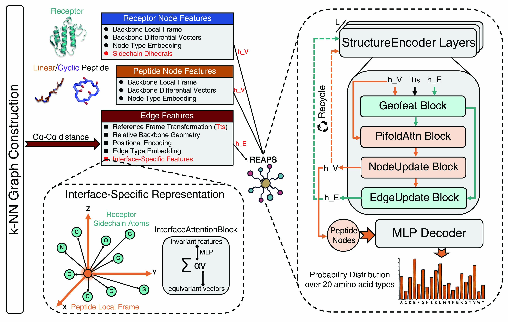

# 🔬 REAPS

REAPS is a receptor-aware geometric graph neural network for peptide binder sequence design.  
It reframes peptide design as a conditional sequence generation problem by treating the receptor as a fully observable all-atom context, enabling the design of both linear and macrocyclic peptide binders.



## 🔧 Installation

We provide the following commands to reproduce the environment for running REAPS on Linux systems:
```bash
conda env create -f environment.yaml
conda activate REAPS
pip install -e .
```

## ⚡ Inference

Here we provide a simple inference command for peptide sequence design from a given protein–peptide complex structure. For optimal performance, we recommend using a checkpoint trained with a relatively low noise level.

### 📦 Model checkpoints

Pretrained model checkpoints are available on Zenodo: https://zenodo.org/records/19591251

Download the archive and extract it into the `checkpoints/` directory:

```bash
mkdir -p checkpoints
tar -xvzf REAPS_ckpts.tar.gz -C checkpoints/
```

### 📏 Linear peptide binder sequence design

```bash
python inference.py \
  --pdb_file example/1T79.pdb \
  --peptide_chain_id B \
  --checkpoint_path checkpoints/REAPS_n0.02_pepFT.ckpt \
  --fasta_output_path outputs \
  --num_samples 8 \
  --temperature 0.2 \
  --mode linear
```

### ⭕ Macrocyclic peptide binder sequence design

```bash
python inference.py \
  --pdb_file example/2CK0.pdb \
  --peptide_chain_id P \
  --checkpoint_path checkpoints/REAPS_n0.02_cyclicFT.ckpt \
  --fasta_output_path outputs \
  --num_samples 8 \
  --temperature 0.2 \
  --mode cyclic
```

### 📌 Notes

- The input PDB file should contain both receptor and peptide chains, with at least two chains present.
- `--peptide_chain_id` specifies the peptide chain to be designed.
- Use a checkpoint that matches the selected design mode:
  - `linear` mode → checkpoint for linear peptide binder sequence design
  - `cyclic` mode → checkpoint for macrocyclic peptide binder sequence design

## 📕 Training

### 📦 Data preprocessing
The data preprocessing scripts used for training and testing are available in `notebooks/`.

The processed datasets are available on Zenodo: https://zenodo.org/records/19600852

The downloaded archive is approximately 10.6 GB in size. After downloading, extract the archive with:

```bash
mkdir -p /path/to/your/data/root
tar -xvzf REAPS_datasets.tar.gz -C /path/to/your/data/root
```

### 🤖 Training scripts

REAPS uses a Hydra-based training pipeline built on PyTorch Lightning. Training is launched through the main training script together with configuration files under `configs/`.

#### 🔥 Pre-training on multi-chain protein complexes

```bash
python train.py \
  --config-path configs \
  --config-name pre_training.yaml \
  paths.data_dir=/path/to/your/data/root \
  data=PPI_dataset \
  data.mode=pre-training \
  data.max_tokens_per_batch=14000 \
  model.backbone_noise_scale=0.02 \
  model.lr=1e-3 \
  trainer.max_epochs=200 \
  logger.wandb.offline=True
```

#### 📏 Linear peptide binder sequence design fine-tuning

```bash
python train.py \
  --config-path configs \
  --config-name fine_tuning.yaml \
  pretrained_weights_path=/path/to/pre-training/ckpt \
  paths.data_dir=/path/to/your/data/root \
  data=PPI_dataset \
  data.mode=fine-tuning \
  data.max_tokens_per_batch=6000 \
  model.backbone_noise_scale=0.02 \
  model.lr=1e-5 \
  trainer.max_epochs=50 \
  logger.wandb.offline=True
```

#### ⭕ Macrocyclic peptide binder sequence design fine-tuning

```bash
python train.py \
  --config-path configs \
  --config-name fine_tuning.yaml \
  pretrained_weights_path=/path/to/pre-training/ckpt \
  paths.data_dir=/path/to/your/data/root \
  data=CPCore_dataset \
  data.max_tokens_per_batch=12000 \
  model.backbone_noise_scale=0.02 \
  model.lr=1e-4 \
  trainer.max_epochs=50 \
  logger.wandb.offline=True
```

## 🧪 NK3R Peptide Binder Design via Iterative Hallucination

We provide a Jupyter notebook that reproduces the NK3R peptide binder design pipeline described in the paper.

The notebook is located at: `NK3R_hallu_pep_binder_design/NK3R_Xpep_binder_design_pipeline.ipynb`

This notebook shows how REAPS is integrated into an iterative hallucination pipeline for peptide binder design, including backbone generation, receptor-conditioned sequence design, and multi-round structural refinement.

Running this pipeline requires additional dependencies, including [Boltz-2](https://github.com/jwohlwend/boltz), [PyRosetta](https://www.pyrosetta.org/), [ColabFold](https://github.com/YoshitakaMo/localcolabfold), and [HighFold](https://github.com/hongliangduan/HighFold).

## 🙏 Acknowledgements

The core implementation of this repository is built upon [UniIF](https://arxiv.org/abs/2405.18968), with modifications and extensions for receptor-aware peptide binder design.

The source code of UniIF is available at https://github.com/A4Bio/ProteinInvBench. We sincerely thank the authors for their valuable contributions to the community.
